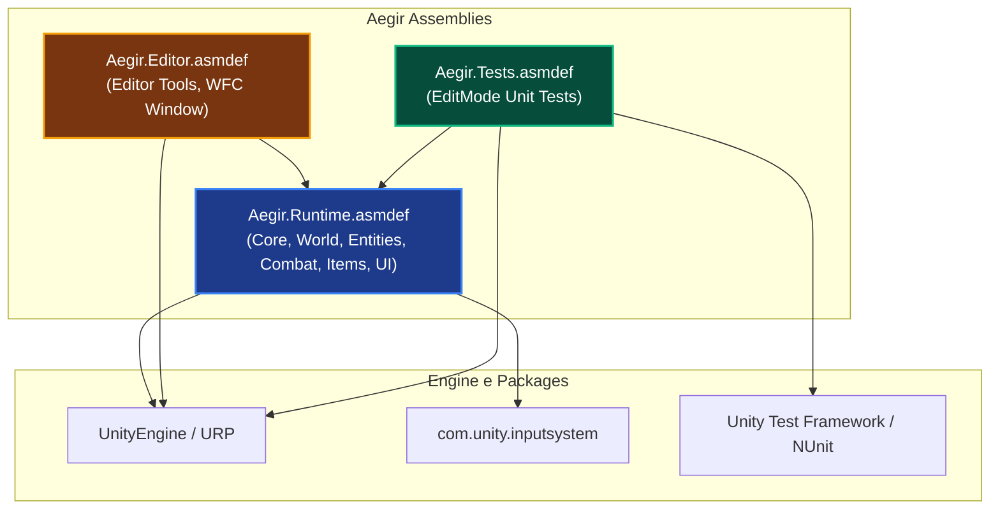
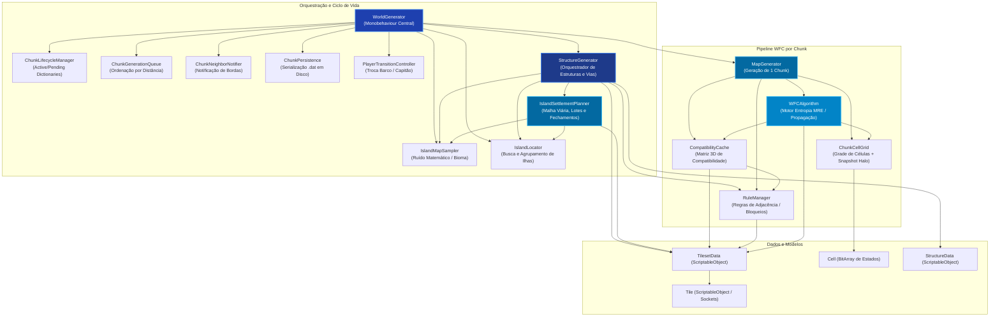
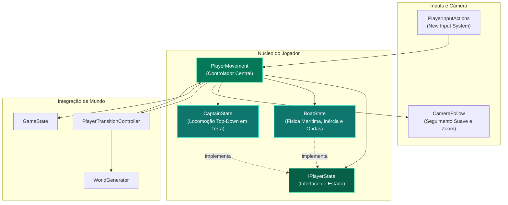
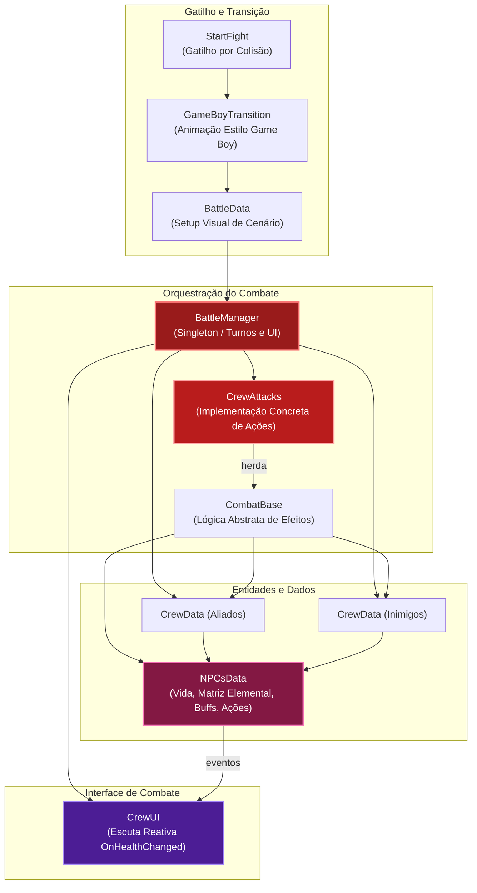
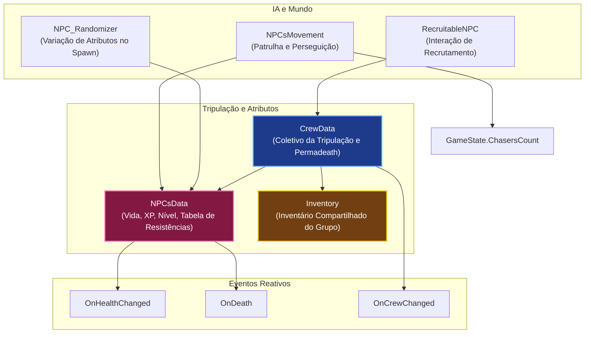
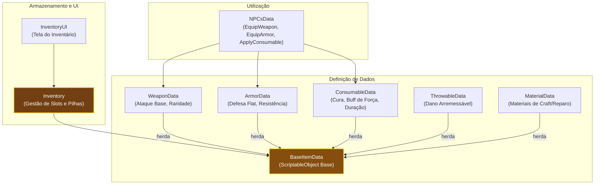
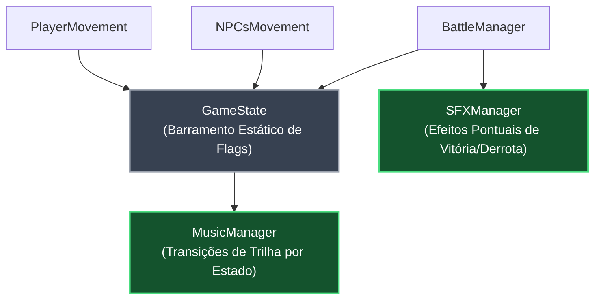
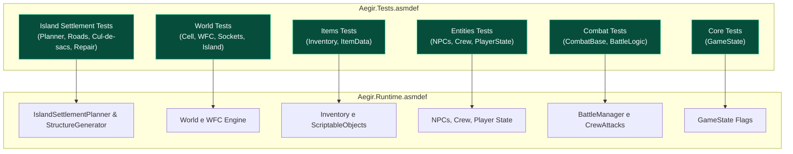

# Arquitetura do Projeto — Aegir

## Visão Geral

**Aegir** é um RPG tático 2D top-down com temática de horror cósmico marítimo e exploração procedural, desenvolvido em Unity (Unity 6 / URP 2D) com C#. O projeto combina mecânicas de navegação marítima e a pé, geração procedural de mundos infinitos via **Wave Function Collapse (WFC)**, combate tático por turnos e gerenciamento de tripulação e inventário.

---

## 1. Estrutura Modular & Assembly Definitions

O projeto é particionado em assemblies independentes para desacoplamento estrito, isolamento de testes e compilações incrementais de alta performance:

---

## 2. Grafos de Conexão dos Subsistemas (Scripts Atuais)

### 2.1 Subsistema de Geração de Mundo & Algoritmo WFC

O ecossistema procedural é orquestrado pelo `WorldGenerator`, que decompõe o ciclo de vida dos chunks, persistência em disco, ordenação por prioridade de distância, geração de assentamentos viários determinísticos e o algoritmo matemático de colapso de função de onda:

---

### 2.2 Subsistema do Jogador & Máquina de Estados

O controle do jogador implementa o padrão State Pattern (`IPlayerState`), alternando dinamicamente a física, rotação e controles entre navegação marítima e locomoção a pé em terra firme:

---

### 2.3 Subsistema de Combate & Batalha por Turnos

O combate opera como um fluxo tático isolado via Singleton (`BattleManager`), executando turnos do jogador e de IA inimiga com cálculo de forças, tabelas de fraqueza elemental e reuso eficiente de botões na UI:

---

### 2.4 Subsistema de Entidades, IA e Tripulação

Gerenciamento individual e coletivo dos tripulantes e criaturas do mapa:

---

### 2.5 Subsistema de Itens & Inventário

Arquitetura ScriptableObject extensível com empilhamento dinâmico e controle de slots:

---

### 2.6 Subsistema de Áudio & Estado Global

---

### 2.7 Estrutura da Suíte de Testes Automatizados

---

## 3. Matriz de Aderência: Código Implementado vs. GDD (Game Design Document)

Comparação detalhada entre as diretrizes especificadas no documento [GDD_AEGIR_WASD.docx.pdf](file:///c:/Users/bretu/OneDrive/Documentos/GitHub/Aegir/GDD_AEGIR_WASD.docx.pdf) e a base de código C# existente:

| Seção do GDD | Funcionalidade / Mecânica | Status Atual no Código | Detalhamento Técnico |
| :--- | :--- | :---: | :--- |
| **2.3.1** | **Andar (Capitão a pé)** | **Implementado** | [PlayerMovement.cs](file:///c:/Users/bretu/OneDrive/Documentos/GitHub/Aegir/Assets/Project/Scripts/Entities/Controllers/PlayerMovement.cs) e [CaptainState.cs](file:///c:/Users/bretu/OneDrive/Documentos/GitHub/Aegir/Assets/Project/Scripts/Entities/Controllers/CaptainState.cs). Movimentação top-down via New Input System (`W/A/S/D` e Gamepad). |
| **2.3.2** | **Embarcar / Desembarcar** | **Implementado** | [PlayerTransitionController.cs](file:///c:/Users/bretu/OneDrive/Documentos/GitHub/Aegir/Assets/Project/Scripts/World/Generators/Utilities/WorldGenerator/PlayerTransitionController.cs). Validação de proximidade ao barco, checagem de tile de costa (layer 1), ocultação de sprite e transição de zoom na câmera. |
| **2.4.1** | **Navegação do Navio** | **Implementado** | [BoatState.cs](file:///c:/Users/bretu/OneDrive/Documentos/GitHub/Aegir/Assets/Project/Scripts/Entities/Controllers/BoatState.cs). Rotação direcional, aceleração, inércia na água e perturbação senoidal matemática de ondas marítimas. |
| **2.5.3** | **Geração de Mares & Chunks WFC** | **Implementado** | [WorldGenerator.cs](file:///c:/Users/bretu/OneDrive/Documentos/GitHub/Aegir/Assets/Project/Scripts/World/Generators/WorldGenerator.cs), [MapGenerator.cs](file:///c:/Users/bretu/OneDrive/Documentos/GitHub/Aegir/Assets/Project/Scripts/World/Generators/MapGenerator.cs) e [WFCAlgorithm.cs](file:///c:/Users/bretu/OneDrive/Documentos/GitHub/Aegir/Assets/Project/Scripts/World/Generators/Utilities/MapGenerator/WFCAlgorithm.cs). Chunks infinitos em espiral, halo de compatibilidade, eliminação de contradições e persistência em disco (.dat). |
| **2.5.3** | **Amostragem e Busca de Ilhas** | **Implementado** | [IslandMapSampler.cs](file:///c:/Users/bretu/OneDrive/Documentos/GitHub/Aegir/Assets/Project/Scripts/World/Generators/Utilities/WorldGenerator/IslandMapSampler.cs) (ruído determinístico) e [IslandLocator.cs](file:///c:/Users/bretu/OneDrive/Documentos/GitHub/Aegir/Assets/Project/Scripts/World/Utilities/IslandLocator.cs) (busca em anel de raio e agrupamento flood-fill de ilhas conexas). |
| **2.5.4** | **Assentamentos, Estruturas & Malha Viária** | **Implementado** | [IslandSettlementPlanner.cs](file:///c:/Users/bretu/OneDrive/Documentos/GitHub/Aegir/Assets/Project/Scripts/World/Generators/Utilities/WorldGenerator/IslandSettlementPlanner.cs), [StructureGenerator.cs](file:///c:/Users/bretu/OneDrive/Documentos/GitHub/Aegir/Assets/Project/Scripts/World/Generators/Utilities/WorldGenerator/StructureGenerator.cs) e [StructureData.cs](file:///c:/Users/bretu/OneDrive/Documentos/GitHub/Aegir/Assets/Project/Scripts/World/Data/StructureData.cs). Planejamento determinístico de malha viária em ilhas conexas (`IslandLocator`), terminações de vias em cul-de-sacs e quinas automáticas em transições de costa (layer < 4), nós em células pares (layer >= 4), fachadas de estruturas voltadas ao Sul (estilo clássico Pokémon), autotiling de 13 tipos topológicos e loop WFC pós-estruturas (`ResolveTileCompatibility`) com eliminação de cortes de estradas e sockets incompatíveis. |
| **2.5.3** | **5 Camadas de Profundidade & Sanidade** | **Parcialmente Implementado** | As camadas de tiles existem em [LayerDefinition.cs](file:///c:/Users/bretu/OneDrive/Documentos/GitHub/Aegir/Assets/Project/Scripts/World/Data/LayerDefinition.cs). Porém, as **5 zonas temáticas** (Litorânea, Mar Cinzento, Abismo Sussurrante, Fossa Esquecida, Coração Adormecido) e a mecânica ativa de **Taxa de Erosão de Sanidade** (0.5 a 18 pt/h, alucinações, motim) ainda não foram codificadas. |
| **2.5.2** | **Sistema de Combate por Turnos** | **Implementado** | [BattleManager.cs](file:///c:/Users/bretu/OneDrive/Documentos/GitHub/Aegir/Assets/Project/Scripts/Combat/BattleManager.cs), [CrewAttacks.cs](file:///c:/Users/bretu/OneDrive/Documentos/GitHub/Aegir/Assets/Project/Scripts/Combat/CrewAttacks.cs) e [BattleData.cs](file:///c:/Users/bretu/OneDrive/Documentos/GitHub/Aegir/Assets/Project/Scripts/Combat/BattleData.cs). Loop de turnos, UI com pooling de botões, seleção por alvo/peso e transição visual Game Boy. |
| **2.5.2** | **Tabela de Dano Elemental & Resistências** | **Implementado** | [NPCsData.cs](file:///c:/Users/bretu/OneDrive/Documentos/GitHub/Aegir/Assets/Project/Scripts/Entities/NPCsData.cs#L225). Fraquezas/imunidades (Fantasma imune a Físico/Veneno e fraco a Sagrado; Esqueleto imune a Gelo), mitigação de armaduras e buffs temporais (`activeEffects`). |
| **2.3.4 / 2.5.5** | **Sistema de Inventário & Itens** | **Parcialmente Implementado** | [Inventory.cs](file:///c:/Users/bretu/OneDrive/Documentos/GitHub/Aegir/Assets/Project/Scripts/Items/Inventory.cs) e [InventoryUI.cs](file:///c:/Users/bretu/OneDrive/Documentos/GitHub/Aegir/Assets/Project/UI/InventoryUI.cs). Armazena slots, empilha itens e categoriza armas/armaduras/consumíveis. Contudo, o **limite por peso em quilos** (50kg player, 150kg navio, debuffs de sobrecarga) e o **baú universal das docas** do GDD ainda utilizam o modelo simplificado de contagem de slots (`_maxItemsPerInventory`). |
| **2.3.5 / 2.4.2** | **Minigame de Pesca (Player e Navio)** | **Planejado / Pendente** | O GDD projeta pesca a pé estilo *Stardew Valley* (trilho vertical) e pesca de içamento com guincho no navio estilo *Dredge* (minigame circular de acerto). Nenhum script de pesca foi implementado até o momento. |
| **2.4.3** | **Reparo do Barco (Mar e Porto)** | **Planejado / Pendente** | Mecânica de gastar materiais de madeira no mar para cura parcial ou gastar moedas em portos para reparo completo. Não implementada. |
| **2.5.10** | **Sistema de Destruição do Barco** | **Parcialmente Implementado** | A morte do Barco resulta em derrota imediata em [BattleManager.cs](file:///c:/Users/bretu/OneDrive/Documentos/GitHub/Aegir/Assets/Project/Scripts/Combat/BattleManager.cs). No entanto, as **fases de dano estéticas** (<25 HP: sprite trincado, -25% velocidade; <10 HP: fumaça, trepidação de câmera, -50% velocidade) e o **drop percentual de itens com respawn no porto** ainda não foram criados. |
| **2.5.11** | **Sistema de Upgrades do Navio** | **Planejado / Pendente** | Tiers de evolução (Casco: 100 a 450 HP; Armazenamento: 150 a 500 kg; Velas: +5% a +15% velocidade; Canhões: 2 a 8 canhões laterais). Não implementado. |
| **2.5.12** | **Mural de Missões (Quests)** | **Planejado / Pendente** | Missões de Coleta, Caça, Entrega e Chefes com bússola direcional nas vilas. Não implementado. |
| **2.5.13** | **Sistema de Bestiário** | **Planejado / Pendente** | Enciclopédia desbloqueada ao encontrar o item Bestiário com contadores progressivos de abates. Não implementado. |
| **4.3.2** | **Menu de Operações / Menu de Pausa** | **Parcialmente Implementado** | O GDD projeta uma barra horizontal superior direita com 6 abas navegáveis (*Inventário, Equipamentos, Status, Bestiário, Navio, Sistema*). Atualmente há apenas menus isolados de tela cheia. |
| **5.1 - 5.3** | **Sistema de Áudio Dinâmico** | **Implementado** | [MusicManager.cs](file:///c:/Users/bretu/OneDrive/Documentos/GitHub/Aegir/Assets/Project/Scripts/Core/MusicManager.cs) e [SFXManager.cs](file:///c:/Users/bretu/OneDrive/Documentos/GitHub/Aegir/Assets/Project/Scripts/Core/SFXManager.cs). Máquina de estados musical orientada ao `GameState` (Menu, Batalha, Perseguição, TerraFirme, Exploração) com fades suaves. |

---

## 4. Próximos Passos Sugeridos de Roadmap (Pós-Sprint)

Com a arquitetura reestruturada e coberta por testes automatizados, as próximas sprints podem focar na implementação dos sistemas-chave descritos no GDD:

1. **Sprint de Sanidade & Camadas Oceânicas:**
   - Implementar o componente `SanityManager` com degradação por camada de profundidade.
   - Definir regras de pós-processamento e névoa/iluminação volumétrica no URP para as 5 camadas do oceano.
2. **Sprint de Estado Crítico & Reparos do Navio:**
   - Adicionar os estados de dano físico do barco (<25 HP e <10 HP) com trocas de sprites e penalidades de velocidade em [BoatState.cs](file:///c:/Users/bretu/OneDrive/Documentos/GitHub/Aegir/Assets/Project/Scripts/Entities/Controllers/BoatState.cs).
   - Implementar a lógica de reparo em alto mar (via inventário) e reparo comercial nas docas.
3. **Sprint do Menu de Pausa Unificado:**
   - Construir a UI horizontal de 6 abas conforme as especificações das páginas 36 e 37 do GDD (*Inventário, Equipamentos, Status do Capitão/Barco, Bestiário, Navio, Sistema*).
4. **Sprint do Minigame de Pesca:**
   - Criar o controlador de pesca com vara (trilho vertical) e pesca pesada embarcada (guincho circular) com gatilho de combate surpresa (45%).
